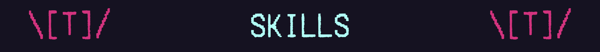
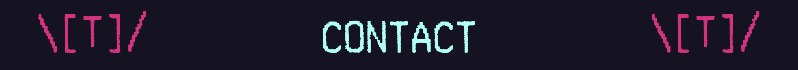
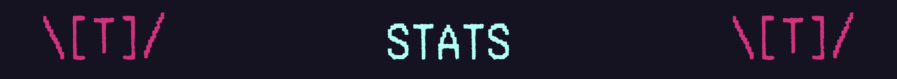

	</img>

 

	</img>
	

		

			
			
			
			
			
			
			
			
			
			
			
			
			
			
		

	

 

	</img>
	

		 
		<a href="https://www.linkedin.com/in/lzbguts/"></img></a>&nbsp;&nbsp;
		<a href="mailto:gustavo.h.felicidade@gmail.com"></img></a>&nbsp;&nbsp;
		<a href="https://www.instagram.com/lzbguts/"></img></a>&nbsp;&nbsp;
	

 

	</img>
	

		 
		
 		
	

